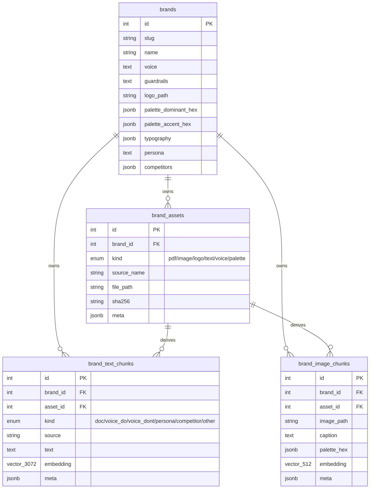

# Phase 2 — Brand knowledge base

> Written 2026-07-18. Companion to [plan.md](plan.md) and [progress.md](progress.md).
> Covers everything shipped in Phase 2 of the AVMS (Agentic Visual Merchandising
> Studio) roadmap: the multimodal brand knowledge base that Phase 3's council
> agents will retrieve from.

---

## 1. What Phase 2 delivers

A brand-scoped knowledge base that stores everything an agent needs to sound
"on-brand":

- **Identity** — logo, dominant + accent colour palettes, typography stack.
- **Voice** — persona paragraph plus paired do / don't guidance.
- **Docs** — free-form text and PDF brand books, chunked and embedded with
  Azure `text-embedding-3-large` (3072-d).
- **Reference imagery** — brand logo, moodboard, and aesthetic images
  embedded with local CLIP ViT-B/32 (512-d), plus a dominant palette per
  image extracted via PIL quantisation.
- **Audience** — persona + competitor list, also embedded so retrieval can
  surface them alongside brand-book snippets.

On top of that store, three services expose the data:

1. **`BrandRAG`** — hybrid retrieval (vector cosine + keyword ILIKE +
   colour distance) that produces a one-shot `BrandContext` bundle.
2. **`BrandUnderstandingScore`** — 0..100 rollup with per-axis breakdown so
   the brand wizard can nudge operators to fill in what's missing.
3. **`/brands/*` REST surface** — auth-guarded endpoints for CRUD,
   ingestion (text / PDF / image / logo / voice / persona / competitors),
   scoring, and debug retrieval.

---

## 2. Files added / changed

### New files

| Path | Purpose |
|---|---|
| [backend/brand/profile.py](backend/brand/profile.py) | Pydantic view models: `BrandIdentity`, `BrandAudience`, `VoicePair`, `BrandProfile`. |
| [backend/brand/ingestion.py](backend/brand/ingestion.py) | Sentence-aware `chunk_text`, `extract_pdf_text` (pypdf), asset dedup by SHA-256, async ingest helpers for text / PDF / voice / persona / competitors / images, palette + typography setters, `_dominant_palette` via `Image.quantize`. |
| [backend/brand/rag.py](backend/brand/rag.py) | `retrieve_text`, `retrieve_images_by_embedding`, `retrieve_images_by_color`, `retrieve_brand_context`, chunk counters, dataclasses `TextHit` / `ImageHit` / `BrandContext`. |
| [backend/brand/understanding.py](backend/brand/understanding.py) | `AXIS_WEIGHTS`, `BrandUnderstandingBreakdown`, `compute_understanding`. |
| [backend/api/routes_brands.py](backend/api/routes_brands.py) | 12 auth-guarded endpoints (see §5). |
| [backend/db/migrations/versions/20260718_1000_e5b7f4d18a29_add_brand_knowledge_base.py](backend/db/migrations/versions/20260718_1000_e5b7f4d18a29_add_brand_knowledge_base.py) | Migration `d92f3a1e6c47` → `e5b7f4d18a29`. |
| [backend/tests/test_brand_unit.py](backend/tests/test_brand_unit.py) | 12 unit tests: chunker, hex helper, palette distance, keyword extraction, understanding score (via `_stub_counts` monkeypatch). |
| [backend/tests/test_brand_routes.py](backend/tests/test_brand_routes.py) | 8 integration tests driven by deterministic fake providers (`_FakeRouter` / `_FakeEmbed` / `_FakeClip`). |

### Changed files

| Path | Change |
|---|---|
| [backend/db/models.py](backend/db/models.py) | Added `TEXT_EMBED_DIM=3072`, `BrandAssetKind` + `BrandTextKind` enums, brand profile columns, and 3 new models: `BrandAsset`, `BrandTextChunk`, `BrandImageChunk`. All wired back to `Brand` via `relationship(..., cascade="all, delete-orphan")`. |
| [backend/brand/__init__.py](backend/brand/__init__.py) | Re-exports `BrandProfile`, `BrandContext`, `TextHit`, `ImageHit`, `compute_understanding`, `AXIS_WEIGHTS`, etc. |
| [backend/api/main.py](backend/api/main.py) | `app.include_router(brands_router)`. |
| [backend/api/schemas.py](backend/api/schemas.py) | Added ~14 new pydantic request/response types (see §5). |
| [backend/scripts/seed_demo_brand.py](backend/scripts/seed_demo_brand.py) | Always overwrites the demo brand's palette / typography and, when EMBED creds are available, ingests 3 voice pairs, a brand-book snippet, an Elena persona, competitor list (Everlane / Frank And Oak / Kotn / COS / Muji), a rendered wordmark logo, and a moodboard swatch. |
| [pyproject.toml](pyproject.toml) | `pypdf>=5.1` in main deps. |
| [progress.md](progress.md) | Phase 2 checklist marked ✅; new "Latest change" entry; Phase 1 log demoted to "Previously". |

---

## 3. Data model

Migration head is now `e5b7f4d18a29`.



### Indexes

- `brand_assets`: `brand_id`, `sha256` (dedup key).
- `brand_text_chunks`: `brand_id`, `asset_id`, `kind`. **No HNSW on
  `embedding`** — pgvector's HNSW is capped at 2000 dims and
  `text-embedding-3-large` is 3072-d. Sequential cosine distance is fast
  enough at brand scale (<10k chunks). Future escape hatches, in order of
  preference:
  1. Switch to `halfvec(3072)` — 4000-dim HNSW cap.
  2. Truncate embeddings via Azure's `dimensions` parameter to ≤2000.
  3. Move to a dedicated vector store (Qdrant / Weaviate / pgvector partitions).
- `brand_image_chunks`: `brand_id`, `asset_id`, plus HNSW cosine on
  `embedding` (512-d fits comfortably).

---

## 4. Modules

### `backend/brand/ingestion.py`

Deterministic, dedup-friendly write path. Every ingest returns an
`IngestResult(asset_id, text_chunks, image_chunks)` describing what
landed.

- `chunk_text(text, target_chars=500, overlap_chars=80)` — sentence-aware
  splitter. Emits ~500-char chunks with an 80-char tail overlap so
  neighbouring chunks share phrasing (helps RAG recall).
- `extract_pdf_text(pdf_bytes)` — pypdf-based; per-page failures log a
  warning but don't abort the whole PDF.
- `_upsert_asset(...)` — dedup by `(brand_id, sha256)`. Re-uploading the
  same file wipes derived chunks and re-embeds so rewrites are safe.
- Async ingesters: `ingest_text`, `ingest_pdf`, `ingest_voice_pair`,
  `set_persona`, `set_competitors` — all embed via the shared
  `ModelRouter.text_embed()`.
- Sync ingester: `ingest_image` — CLIP embedding is a synchronous
  operation, so the API route awaits the async pieces separately and
  calls this directly.
- Profile setters: `set_palette`, `set_typography`, `set_persona`,
  `set_competitors`. Persona + competitors also embed themselves so
  retrieval can surface them alongside brand-book text.
- `_dominant_palette(image, k=5)` — uses `PIL.Image.quantize(colors=k)`
  (median-cut). Zero extra deps (no sklearn / colorthief needed).
- `_normalise_hex(value)` — accepts 3- or 6-char input, uppercases the
  output, rejects malformed strings.

### `backend/brand/rag.py`

Read path. Three retrieval flavours plus a one-shot bundler.

- `retrieve_text(brand_id, query, session, k=5, kinds=None, keyword_weight=0.25)`
  — vector cosine + keyword ILIKE hybrid. Keywords are tokenised via
  `_keywords()` (drops stop words + short tokens, cap at 5). Keyword hits
  get a flat additive bonus so obvious lexical matches don't get buried
  by close-but-off semantic neighbours.
- `retrieve_images_by_embedding(brand_id, query_embedding, k)` — CLIP
  nearest neighbour via pgvector cosine distance (HNSW-backed).
- `retrieve_images_by_color(brand_id, palette_hex, k)` — bidirectional
  palette distance computed in Python (matches each query colour to its
  closest image colour and vice versa, averages the two). Runs on the
  chunk row-set for that brand, so it's O(n) and fine for brand scale.
- `retrieve_brand_context(brand, query, session, ...)` — the entry point
  Phase 3 agents will call. Returns a `BrandContext` bundling doc
  snippets, voice do's, voice don'ts, persona, competitors, top-k
  reference images, and palette hints.
- `count_text_chunks()` / `count_image_chunks()` — reused by the
  understanding scorer.

### `backend/brand/understanding.py`

Explainable 0..100 score. Weights are exposed as a module constant so
they can be tuned without a migration.

```python
AXIS_WEIGHTS = {
    "identity": 20,  # logo (8) + palette≥3 (7) + typography (5)
    "voice":    25,  # min(voice_do_count, voice_dont_count) → target 3
    "docs":     20,  # doc chunks → target 10
    "images":   20,  # image chunks → target 5
    "audience": 15,  # persona (10) + competitors → target 3 (5)
}
```

`compute_understanding(brand, session)` returns a
`BrandUnderstandingBreakdown` with `.total`, per-axis integer scores,
and `.as_dict()` for the API response.

### `backend/brand/profile.py`

Pydantic view models used both by the seed script and by the (upcoming)
brand wizard. Nothing goes in the DB directly — `Brand` stays the
source of truth — but this schema is how agents consume the profile.

---

## 5. REST surface (all under `/brands`, all auth-guarded)

| Method | Path | Purpose |
|---|---|---|
| `POST` | `/brands` | Create brand (`BrandCreateRequest` → `BrandOut`). 409 on duplicate slug. |
| `GET` | `/brands/{slug}` | Read brand profile. |
| `PATCH` | `/brands/{slug}` | Update identity fields (name / voice / guardrails / palette / typography). |
| `POST` | `/brands/{slug}/assets/text` | Ingest free-form text (JSON body). |
| `POST` | `/brands/{slug}/assets/pdf` | Multipart PDF upload, 25 MB cap, `application/pdf` enforced. |
| `POST` | `/brands/{slug}/assets/image` | Multipart image upload, 15 MB cap, JPEG/PNG/WebP only. Optional `caption` form field. |
| `POST` | `/brands/{slug}/assets/logo` | Same as image but stored with `BrandAssetKind.LOGO`; updates `brand.logo_path`. |
| `POST` | `/brands/{slug}/voice` | Add one do / don't pair. |
| `POST` | `/brands/{slug}/persona` | Set + re-embed the persona paragraph. |
| `POST` | `/brands/{slug}/competitors` | Set + re-embed competitor list. |
| `GET` | `/brands/{slug}/understanding` | Returns `{score, breakdown}`. |
| `POST` | `/brands/{slug}/retrieve` | Hybrid retrieval — debug endpoint that Phase 3 agents will call server-side. |

Guards:
- `_MAX_PDF_BYTES = 25 MB`, `_MAX_IMAGE_BYTES = 15 MB`.
- `_ALLOWED_IMAGE_TYPES = {"image/jpeg", "image/png", "image/webp"}`.
- Media type is resolved from `Content-Type`, falling back to filename
  extension via `mimetypes.guess_type`.
- Every handler depends on `get_current_user`, so unauth requests get 401.

---

## 6. Integration with the rest of the system

- **Model router** — `ingestion` and `rag` call `router.text_embed()` and
  `router.image_embed_pil()` on the same `ModelRouter` used by Phase 1.
  No new providers were introduced.
- **FastAPI app** — [backend/api/main.py](backend/api/main.py) already
  used `include_router(auth_router)` and `include_router(displays_router)`;
  Phase 2 adds `include_router(brands_router)`. The lifespan hook
  (Phase 1) is untouched.
- **Alembic** — one new revision, `e5b7f4d18a29`, chained onto Phase 1's
  `d92f3a1e6c47`. `alembic upgrade head` is idempotent and reversible.
- **Seed script** — `seed_demo_brand.py` now populates a realistic
  Northwind-style brand profile *and* seeds knowledge chunks when Azure
  creds are present. Skip is silent when creds are missing (so CI can
  still run the products-only path).
- **Tests** — `test_brand_unit.py` is dep-free (no DB, no network).
  `test_brand_routes.py` uses the real DB but monkeypatches the router
  onto `_FakeRouter` (SHA-256-driven deterministic 3072-d text vectors,
  512-d image vectors) so tests never call Azure or CLIP.

---

## 7. Verification results

Ran against the local Postgres 16 + pgvector 0.8.2 container.

```
alembic current   → e5b7f4d18a29 (head)
pytest backend/tests → 33 passed, 0 failed, 27 warnings in ~9s
python -m backend.scripts.seed_demo_brand → exit 0
  (ingested persona, 3 voice pairs, brand-book snippet, logo, moodboard
   via LIVE Azure text-embedding-3-large + local CLIP)
```

Test breakdown:
- 12 pre-Phase-2 tests still passing.
- 12 new unit tests (`test_brand_unit.py`).
- 8 new integration tests (`test_brand_routes.py`).
- 1 chunker test bug (`zip(chunks, chunks[1:], strict=True)` — always
  raises because `chunks[1:]` is one shorter) fixed by dropping `strict=True`.

Lint / type: `get_errors` reports zero errors across all Phase 2 files.

---

## 8. Known caveats & follow-ups (not blockers for Phase 3)

- **3072-d text embeddings use sequential cosine scan.** Fine at brand
  scale; revisit if a single brand exceeds ~10k chunks (see §3 for the
  three escape hatches).
- **JWT secret is 20 bytes** → `InsecureKeyLengthWarning`. Carried over
  from Phase 1; bump to ≥32 bytes before shipping.
- **Windows event-loop shim** in `backend/api/main.py` and
  `backend/workers/app.py` emits a Python 3.14 `DeprecationWarning`.
  Cosmetic; the shim is still required for psycopg async on Windows.
- **`starlette.testclient` deprecation warning** re: httpx — upstream
  issue, no action needed.
- **CLIP mismatch on smoke image (headphones → sneaker)** — Phase 1
  known issue, tracked separately from brand KB work.

---

## 9. What Phase 3 gets to lean on

Phase 3 (Creative / Psychology / Commercial specialists + Brand Guardian
critic + Opus orchestrator) can now assume:

- **A brand exists** with identity + palette + typography populated
  (either via the wizard or the seed script).
- **`retrieve_brand_context(brand, query, session)`** returns a bundled
  `BrandContext` in one call — no per-agent RAG glue needed.
- **`BrandUnderstandingScore ≥ threshold`** can gate agent runs so
  low-context brands fall back to a "please add more brand data" flow.
- **All ingestion is idempotent** (SHA-256 dedup) so retrying failed
  uploads is safe.
