# AVMS — System Overview

> **Snapshot: 2026-07-18.** A single-file tour of what has been built so far,
> what the running system actually does, how a request flows through it end to
> end, and every non-obvious decision we locked in along the way. Companion to
> [plan.md](plan.md), [progress.md](progress.md), [PHASE_2_SUMMARY.md](PHASE_2_SUMMARY.md)
> and [images-and-clip.md](images-and-clip.md).

---

## 1. What AVMS is

**Agentic Visual Merchandising Studio (AVMS)** is a web app that turns a photo
of any retail display into a scored, brand-aware improvement plan — with a
visualised "after" mockup.

**Target UX (once all phases land):**

1. User uploads a display photo.
2. **Perception** grounds the scene (products, OCR text, zones, palette, lighting).
3. A **5-agent council** (Creative + Retail Psychology + Commercial +
   Brand Guardian critic + Opus Orchestrator) produces **9 tips** (3 per specialist).
4. A **rubric-driven scorer** returns a before/after score.
5. An **image-edit model** renders a realistic "after" mockup.
6. Every accept/reject feeds a per-brand learning loop.

**Where we are right now:** Phases 0, 1, 2 are complete. Phase 3 (the agent
council) is next.

---

## 2. Stack decisions (locked in)

| Layer | Choice | Why |
|---|---|---|
| Frontend | **Next.js** (App Router, TypeScript, Tailwind) in `frontend/` | Scaffolded but not yet feature-wired. |
| Backend / API / agents | **Python 3.14** + **FastAPI** + Claude Agent SDK in `backend/` | Single async runtime for API + workers + agents. |
| Reasoning / vision | **Anthropic Claude** — Sonnet 4.5 (`claude-sonnet-4-5-20250929`), Opus 4.1 (`claude-opus-4-1-20250805`), Haiku 4.5 (`claude-haiku-4-5-20251001`) | Sonnet for perception + specialists, Opus for orchestrator, Haiku for the cheap Brand-Guardian critic. |
| Text embeddings | **Azure OpenAI `text-embedding-3-large` (3072-d)** | Best-in-class recall for brand-book RAG. |
| Image embeddings | **`open_clip_torch` CLIP ViT-B/32 (512-d)**, local CPU | Free, no API cost, no rate limits. |
| After-mockup image gen | **Gemini 2.5 Flash Image** + Cloudflare Workers AI (SDXL) fallback | Free tiers. Not yet wired. |
| Database | **Postgres 16 + pgvector 0.8.2** (local Docker) | Single store for OLTP + vectors. |
| Async jobs | **`procrastinate`** (Postgres-backed) | No extra broker (Redis / RabbitMQ) needed. |
| Image storage | Local filesystem (`backend/storage/`, gitignored) | Simple; swap to object storage later. |
| Auth | FastAPI + bcrypt + JWT (`HS256`) | Minimal; JWT secret is a Phase-1 known caveat (bump to ≥32 bytes before shipping). |
| Package layout | Single editable install (`pip install -e ".[ml]"`) | ML deps behind the `ml` extra so CI stays lean. |

**Consequential decisions we already committed to:**

- **Claude tool-use, not free-form JSON**, for perception. Guarantees a valid
  `SceneGraph` (no fragile regex on prose).
- **HNSW cosine** on all 512-d vector columns (pgvector cap = 2000 dims).
- **Sequential cosine scan** on the 3072-d text-chunk column (HNSW can't hold
  it). Escape hatches documented in [PHASE_2_SUMMARY.md](PHASE_2_SUMMARY.md) §3.
- **Category-specific silhouettes** for demo SKUs, not solid colour tiles,
  because CLIP collapses solid tiles to nearly-identical vectors.
- **`WindowsSelectorEventLoopPolicy`** forced at import time in workers + API
  because psycopg async requires it (Windows defaults to Proactor). Three
  patch sites documented in [progress.md](progress.md).
- **Deterministic fake providers in tests** (SHA-256-driven vectors) so the
  test suite never calls Azure / Anthropic / CLIP.

---

## 3. Repository layout (current)

```
agentic_automation_project/
├── alembic.ini
├── docker-compose.yml              # Postgres 16 + pgvector
├── pyproject.toml                  # avms-backend; [ml] extra = torch + open-clip
├── .env / .env.example
│
├── plan.md                         # locked roadmap
├── progress.md                     # phase-by-phase status
├── PHASE_2_SUMMARY.md              # deep dive on brand KB
├── images-and-clip.md              # deep dive on CLIP + images
├── SYSTEM_OVERVIEW.md              # (this file)
│
├── backend/
│   ├── config.py                   # pydantic-settings, loads .env
│   ├── api/
│   │   ├── main.py                 # FastAPI app + lifespan (opens procrastinate)
│   │   ├── deps.py                 # get_db, get_current_user
│   │   ├── security.py             # bcrypt + JWT (HS256)
│   │   ├── schemas.py              # all request/response models
│   │   ├── routes_auth.py          # /auth/register, /login, /me
│   │   ├── routes_brands.py        # 12 endpoints under /brands (Phase 2)
│   │   └── routes_displays.py      # /displays/analyze, /analyses/{id} (Phase 1)
│   │
│   ├── db/
│   │   ├── base.py                 # SQLAlchemy Declarative Base
│   │   ├── models.py               # User / Brand / Product / Display / Analysis
│   │   │                           # + BrandAsset / BrandTextChunk / BrandImageChunk
│   │   └── migrations/versions/    # 5 Alembic revisions (see §5)
│   │
│   ├── model_router/
│   │   ├── router.py               # ModelRouter façade
│   │   ├── claude_provider.py      # .vision(), .vision_tool(), .chat()
│   │   ├── azure_embedding_provider.py   # text-embedding-3-large (3072-d)
│   │   ├── clip_provider.py        # embed_image(paths) / embed_pil(imgs)
│   │   └── gemini_image_provider.py      # (stub, Phase 4)
│   │
│   ├── agents/
│   │   ├── perception/             # ✅ Phase 1: Claude vision + SceneGraph
│   │   ├── council/                # 🚧 Phase 3 skeletons (creative, psychology, commercial, guardian)
│   │   ├── orchestrator/           # 🚧 Phase 3 skeleton (Opus)
│   │   ├── scoring/                # ⏳ Phase 4 skeleton
│   │   └── mockup/                 # ⏳ Phase 4 skeleton
│   │
│   ├── brand/                      # ✅ Phase 2 knowledge base
│   │   ├── profile.py              # Pydantic view models
│   │   ├── ingestion.py            # chunk_text, extract_pdf_text, ingest_*
│   │   ├── rag.py                  # retrieve_text / _images / _brand_context
│   │   ├── understanding.py        # BrandUnderstandingScore
│   │   └── product_matcher.py      # CLIP crop → pgvector NN
│   │
│   ├── workers/
│   │   ├── app.py                  # procrastinate App (SelectorEventLoop shim)
│   │   └── tasks.py                # avms.run_perception
│   │
│   ├── scripts/
│   │   ├── run_api.py              # uvicorn under asyncio.Runner(SelectorEventLoop)
│   │   ├── seed_demo_brand.py      # demo brand + 30 SKUs + brand-KB data
│   │   ├── build_mock_display.py   # renders storage/smoke/mock_display.jpg
│   │   ├── live_smoke.py           # in-process perception smoke
│   │   └── http_smoke.py           # HTTP-level upload + poll smoke
│   │
│   ├── storage/                    # gitignored uploads + seed renders
│   │   ├── brands/<slug>/…         # brand asset raw files
│   │   ├── displays/<slug>/…       # uploaded display photos
│   │   ├── seed/demo-brand/…       # 30 procedural product PNGs
│   │   └── smoke/…                 # mock display + smoke output
│   │
│   └── tests/                      # pytest, 33 passing
│       ├── conftest.py
│       ├── test_health.py
│       ├── test_perception.py / test_perception_worker.py
│       ├── test_displays.py
│       ├── test_brand_unit.py      # 12 tests
│       └── test_brand_routes.py    # 8 tests
│
└── frontend/                       # Next.js scaffold only (no feature UI yet)
```

---

## 4. Data model (as of migration `e5b7f4d18a29`)

```mermaid
erDiagram
    users ||--o{ brands : owns
    brands ||--o{ products : catalogue
    brands ||--o{ displays : uploads
    displays ||--o{ analyses : produces
    brands ||--o{ brand_assets : owns
    brands ||--o{ brand_text_chunks : owns
    brands ||--o{ brand_image_chunks : owns
    brand_assets ||--o{ brand_text_chunks : derives
    brand_assets ||--o{ brand_image_chunks : derives

    users              { int id PK, string email, string password_hash }
    brands             { int id PK, string slug, string name, text voice, text guardrails,
                          string logo_path, jsonb palette_dominant_hex, jsonb palette_accent_hex,
                          jsonb typography, text persona, jsonb competitors }
    products           { int id PK, int brand_id FK, string sku, string category,
                          string name, string image_path, vector_512 embedding }
    displays           { int id PK, int brand_id FK, string image_path, jsonb meta }
    analyses           { int id PK, int display_id FK, enum status, string model_id,
                          string prompt_version, jsonb scene_graph, text error }
    brand_assets       { int id PK, int brand_id FK, enum kind, string sha256, string file_path }
    brand_text_chunks  { int id PK, int brand_id FK, int asset_id FK, enum kind,
                          text text, vector_3072 embedding }
    brand_image_chunks { int id PK, int brand_id FK, int asset_id FK, string image_path,
                          text caption, jsonb palette_hex, vector_512 embedding }
```

**Index decisions:**

- `products.embedding` — **HNSW cosine** (migration `c4e0d7f2a8b3` swapped
  the original ivfflat, which required centroid training we didn't want).
- `brand_image_chunks.embedding` — **HNSW cosine** (512-d fits under
  pgvector's 2000-d cap).
- `brand_text_chunks.embedding` — **no HNSW** (3072-d exceeds the cap).
  Sequential cosine scan is fine at brand scale; three escape hatches
  documented in [PHASE_2_SUMMARY.md](PHASE_2_SUMMARY.md#3-data-model).

---

## 5. Alembic migration history

| Rev | Purpose |
|---|---|
| `2f2073f4a471` | Initial `users` table. |
| `8b3a1c5f9d21` | `brands` + `products` (with `vector(512)` on products). |
| `c4e0d7f2a8b3` | Swap ivfflat → **HNSW** cosine on `products.embedding`. |
| `d92f3a1e6c47` | `displays` + `analyses` (JSONB scene graph, status enum). |
| `e5b7f4d18a29` | Phase 2 brand KB: profile columns + `brand_assets` + `brand_text_chunks` (3072-d) + `brand_image_chunks` (512-d HNSW). |

`alembic upgrade head` → `e5b7f4d18a29`.

---

## 6. What the system does today (end-to-end flow)

### 6.1 One-time setup

```
docker compose up -d           # Postgres 16 + pgvector on :5432
alembic upgrade head           # migrations up to e5b7f4d18a29
pip install -e ".[ml]"         # torch 2.13.0+cpu + open-clip
python -m backend.scripts.seed_demo_brand
                               # inserts demo-brand + 30 SKUs (with CLIP vectors)
                               # + persona, voice do/don'ts, brand-book snippet,
                               #   logo, moodboard (via LIVE Azure embeddings + CLIP)
python -m backend.scripts.run_api          # uvicorn on :8000 (SelectorEventLoop)
procrastinate --app=backend.workers.app worker    # background worker
```

### 6.2 Auth

- `POST /auth/register {email, password}` → `{access_token}`.
- `POST /auth/login {email, password}` → `{access_token}`.
- `GET /auth/me` (Bearer) → `{id, email}`.
- Hash: bcrypt. Token: JWT HS256. Expiry from `config.JWT_EXPIRES_MINUTES`.

### 6.3 Brand knowledge base (Phase 2 — live)

All under `/brands`, all Bearer-guarded.

| Method | Path | Purpose |
|---|---|---|
| `POST` | `/brands` | Create brand. 409 on duplicate slug. |
| `GET` | `/brands/{slug}` | Read profile. |
| `PATCH` | `/brands/{slug}` | Update identity / palette / typography. |
| `POST` | `/brands/{slug}/assets/text` | Ingest free-form text. |
| `POST` | `/brands/{slug}/assets/pdf` | Multipart PDF, 25 MB cap. |
| `POST` | `/brands/{slug}/assets/image` | Multipart image, 15 MB cap, JPEG/PNG/WebP only. |
| `POST` | `/brands/{slug}/assets/logo` | Same as image + updates `brand.logo_path`. |
| `POST` | `/brands/{slug}/voice` | Add do / don't pair. |
| `POST` | `/brands/{slug}/persona` | Set + re-embed persona paragraph. |
| `POST` | `/brands/{slug}/competitors` | Set + re-embed competitor list. |
| `GET` | `/brands/{slug}/understanding` | Returns `{score, breakdown}` (0..100, per-axis). |
| `POST` | `/brands/{slug}/retrieve` | Hybrid retrieval debug endpoint. |

**Ingestion path:**

1. Read multipart / JSON body.
2. Enforce size + MIME caps.
3. Compute SHA-256 → `_upsert_asset` dedups by `(brand_id, sha256)`;
   re-uploads wipe derived chunks and re-embed (idempotent).
4. **Text / PDF** → `chunk_text` (sentence-aware, ~500-char chunks with
   80-char tail overlap) → Azure `text-embedding-3-large` → row per chunk in
   `brand_text_chunks`.
5. **Images** → `_dominant_palette` via `PIL.Image.quantize(colors=5)` (no
   sklearn / colorthief needed) → CLIP ViT-B/32 → row in `brand_image_chunks`.
6. Persona + competitors also embed themselves so RAG can surface them.

**Retrieval (`retrieve_brand_context`):**

1. Vector cosine + keyword ILIKE hybrid on text chunks
   (`keyword_weight=0.25`, stop-word filter, top-5 tokens).
2. CLIP nearest neighbour on image chunks (HNSW-backed).
3. Bidirectional palette distance for colour queries (O(n) in Python,
   fine at brand scale).
4. Returns a single `BrandContext(docs, voice_do, voice_dont, persona,
   competitors, images, palette_hints)` bundle — the exact shape Phase 3
   agents will consume.

**`BrandUnderstandingScore`:** weighted 0..100 rollup with per-axis
integer breakdown.

```python
AXIS_WEIGHTS = {
    "identity": 20,   # logo (8) + palette ≥ 3 (7) + typography (5)
    "voice":    25,   # min(do, dont) → target 3
    "docs":     20,   # doc chunks → target 10
    "images":   20,   # image chunks → target 5
    "audience": 15,   # persona (10) + competitors → target 3 (5)
}
```

### 6.4 Display analysis (Phase 1 — live)

```mermaid
flowchart LR
    A[User uploads display photo] --> B[POST /displays/analyze]
    B --> C[Persist JPEG under storage/displays/&lt;slug&gt;/]
    C --> D[Insert displays + analyses status=PENDING]
    D --> E[procrastinate defer avms.run_perception job_id]
    E --> F[HTTP 202 with display_id + analysis_id + job_id]

    F -.poll.-> G[GET /analyses/&#123;id&#125;]
    G -->|status=PENDING/RUNNING| G

    E ==> W1[Worker picks up job]
    W1 --> W2[status=RUNNING]
    W2 --> W3[ClaudeProvider.vision_tool submit_scene_graph]
    W3 --> W4[Validated SceneGraph<br/>prompt_version + model_id stamped]
    W4 --> W5[For each bbox: PIL.crop the region]
    W5 --> W6[CLIPProvider.embed_pil crops → 512-d]
    W6 --> W7[pgvector NN: Product.embedding.cosine_distance]
    W7 --> W8[Enrich SceneGraph with product_id + confidence]
    W8 --> W9[Persist scene_graph JSONB, status=COMPLETE]

    G -->|status=COMPLETE| H[Client renders SceneGraph overlay]
```



**Why this shape:**

- **HTTP returns 202 immediately** — the client polls; no long-poll / no
  websockets yet.
- **Perception uses Claude tool-use (`vision_tool`)** with a strict
  `input_schema` matching `SceneGraph` Pydantic. If Claude ever emits an
  invalid tool call, the worker fails the analysis with a stamped error
  instead of persisting garbage.
- **`prompt_version` (SHA-256 of the prompt template) + `model_id`** are
  written on every analysis row → replayability + prompt-A/B accounting.
- **CLIP is fully local** — no API cost, no rate limit. First run downloads
  `~150 MB` from HuggingFace, then cached forever
  (see [images-and-clip.md](images-and-clip.md)).

---

## 7. Model router — one seam, four providers

`ModelRouter` (in `backend/model_router/router.py`) is the single façade the
rest of the code talks to. That means tests can monkeypatch one object and
substitute deterministic fakes.

| Provider | Method(s) | Backend |
|---|---|---|
| `ClaudeProvider` | `.vision(prompt, image)`, `.vision_tool(prompt, image, tool)`, `.chat(...)` | Anthropic SDK. Sonnet 4.5 / Opus 4.1 / Haiku 4.5. |
| `AzureEmbeddingProvider` | `.text_embed(texts) -> [[float]*3072]` | Azure OpenAI `text-embedding-3-large`. |
| `CLIPProvider` | `.embed_image(paths)`, `.embed_pil(images) -> [[float]*512]` | Local `open_clip_torch` ViT-B/32 on CPU. |
| `GeminiImageProvider` | *(stub)* Phase 4 mockup gen. | Google Gemini 2.5 Flash Image. |

---

## 8. Agent architecture (locked design, partial implementation)

| Agent | Model | Status | Role |
|---|---|---|---|
| **Perception** | Sonnet 4.5 (vision + tool-use) | ✅ Phase 1 | Products, OCR, zones, palette, lighting → `SceneGraph`. |
| **Creative** | Sonnet 4.5 | ⏳ Phase 3 | Composition, colour, framing, props. |
| **Retail Psychology** | Sonnet 4.5 | ⏳ Phase 3 | Emotional cues, typography urgency, customer flow. |
| **Commercial** | Sonnet 4.5 | ⏳ Phase 3 | Cross-sell, basket-building, top-seller placement. |
| **Brand Guardian** *(critic)* | Haiku 4.5 | ⏳ Phase 3 | Rejects off-brand / hallucinated tips. Cheap. |
| **Orchestrator** | Opus 4.1 | ⏳ Phase 3 | Dedupe, resolve conflicts, rank, guarantee 3×3=9, build mockup prompt. |

Each specialist will emit structured JSON `{tip, rationale, evidence[],
impact_estimate, brand_refs[]}` and receive `BrandContext` from
`retrieve_brand_context` — no per-agent RAG glue needed. Phase 3 skeletons
already exist under `backend/agents/council/`.

---

## 9. Async execution model

- **`procrastinate` Postgres-backed queue.** No Redis / RabbitMQ.
- Task registry: `avms.run_perception` (Phase 1). More join in Phase 3
  (probably one task per council pass) and Phase 4 (`avms.render_mockup`).
- **Windows event-loop shim** is critical:
  - psycopg's async transport needs `SelectorEventLoop`; Windows defaults
    to Proactor. If left unfixed, workers boot but every DB call raises.
  - Fixed in three places:
    1. `backend/workers/app.py` sets `WindowsSelectorEventLoopPolicy` at
       import time (worker CLI path).
    2. `backend/api/main.py` uses a FastAPI `lifespan` that opens the
       shared procrastinate `App` so route handlers can `defer_async`
       without hitting `AppNotOpen`.
    3. `backend/scripts/run_api.py` runs uvicorn under
       `asyncio.Runner(loop_factory=SelectorEventLoop)` because
       Python 3.14 ignores the now-deprecated
       `asyncio.set_event_loop_policy`.

---

## 10. Testing

`pytest backend/tests` → **33 passed, 0 failed** as of Phase 2.

| Suite | Count | Notes |
|---|---|---|
| `test_health.py` | 1 | `/health` smoke. |
| `test_perception.py` / `test_perception_worker.py` | 6 | Tool-call success, empty scene, missing tool call, schema violation, worker state transitions. |
| `test_displays.py` | 6 | HTTP-level upload + polling with mocked perception. |
| `test_brand_unit.py` | 12 | Chunker, hex helper, palette distance, keyword extraction, understanding score (all dep-free). |
| `test_brand_routes.py` | 8 | Real DB, but router monkeypatched to `_FakeRouter` (SHA-256-driven vectors) — no Azure / Anthropic / CLIP calls. |

Live verifications (not in CI, run manually):

- `backend/scripts/live_smoke.py` — in-process perception against real Claude
  + real CLIP. Wrote `backend/storage/smoke/scene_9.json`.
- `backend/scripts/http_smoke.py` — full HTTP path: register → upload →
  poll. End-to-end result on record:
  `analysis 11 status=COMPLETE model=claude-sonnet-4-5-20250929 prompt_version=c3264446f288 products=5`.

---

## 11. Roadmap status (from [progress.md](progress.md))

| Phase | Scope | Status |
|---|---|---|
| **0** | Foundations (repo, Docker, Alembic, auth, model router, workers scaffold, seed script, tests bootstrap, Next.js scaffold) | ✅ |
| **1** | Perception pipeline (Claude vision tool-use, `SceneGraph`, CLIP product matcher, `POST /displays/analyze`, `GET /analyses/{id}`, procrastinate worker) | ✅ |
| **2** | Brand knowledge base (multimodal ingestion, `BrandRAG`, `BrandUnderstandingScore`, `/brands/*` REST) | ✅ |
| **3** | Agent council (Creative + Psychology + Commercial + Brand Guardian + Opus Orchestrator) | ⏳ next |
| **4** | Scoring & after-mockup (`docs/rubric.md`, rubric scorer, Gemini editor + Cloudflare fallback) | ⏳ |
| **5** | Web UX (brand wizard, capture flow, analysis view, result view, history) | ⏳ |
| **6** | Feedback loop (accept/reject logging, nightly re-rank, agent-quality dashboard) | ⏳ |
| **7** | Trend intelligence | ⏸ deferred until POC validated |

---

## 12. Known caveats (non-blockers)

- **CLIP smoke mismatch** — 4/5 correct. Headphones matched `FTW-SNK-016`
  instead of `TCH-HDP-029`. Fixes tracked in
  [images-and-clip.md](images-and-clip.md) §7 (richer seed renders,
  per-category shortlist, colour-hist tiebreaker, or ViT-L/14 on GPU).
- **JWT secret is 20 bytes** → `InsecureKeyLengthWarning`. Bump to ≥32
  bytes before shipping.
- **3072-d text chunks use sequential cosine scan** (no HNSW). Fine at
  brand scale; escape hatches in [PHASE_2_SUMMARY.md](PHASE_2_SUMMARY.md) §3.
- **Windows event-loop shim** emits a Python 3.14 `DeprecationWarning`.
  Cosmetic; still required.
- **`starlette.testclient` deprecation warning** — upstream httpx issue,
  no action needed.

---

## 13. One-paragraph summary

> AVMS today accepts a phone photo of a shelf, has Claude Sonnet 4.5 see
> the scene under a strict tool-call schema, crops each detected product,
> asks a local CPU CLIP model which SKU from the brand's catalogue it is,
> and persists a fully-provenance-stamped `SceneGraph` behind an async
> procrastinate job. In parallel, a brand can be built up via a multimodal
> knowledge base — PDFs and text chunked and embedded with Azure
> `text-embedding-3-large`, imagery embedded with CLIP, palettes extracted
> with PIL, voice do/don'ts + persona + competitors all embedded — and
> queried through a hybrid vector + keyword + colour retriever that
> returns one `BrandContext` bundle. Everything runs on local Postgres 16
> + pgvector, everything is behind JWT auth, and the entire test suite
> (33 tests) runs without touching any external API. The next mile is
> Phase 3: five Claude sub-agents standing on top of that context to
> emit ranked, brand-safe merchandising tips.
